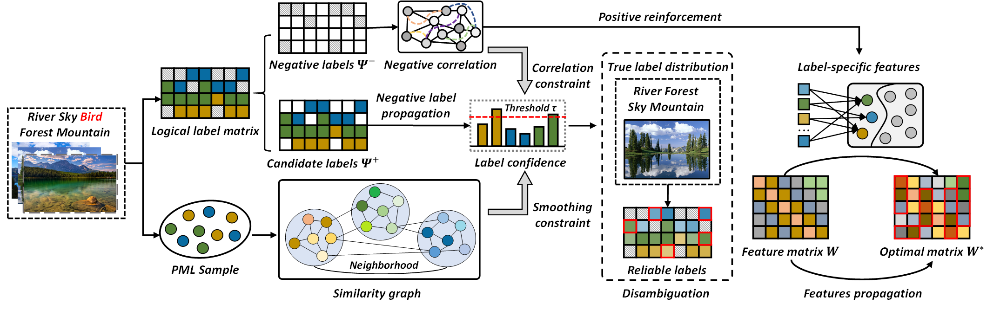

## Negative Label Is Also Useful: Negative-Driven Propagations for Partial Multi-Label Learning
The article "[Negative Label Is Also Useful: Negative-Driven Propagations for Partial Multi-Label Learning](https://ieeexplore.ieee.org/document/10533859)" has been accepted by IEEE Transactions on Multimedia.

## Flow chart


## Citing
If you find this code useful, please consider to cite our work.
```
@article{zhong2024negative,
  title={Negative Label and Noise Information Guided Disambiguation for Partial Multi-Label Learning},
  author={Zhong, Jingyu and Shang, Ronghua and Zhao, Feng and Zhang, Weitong and Xu, Songhua},
  journal={IEEE Transactions on Multimedia},
  year={2024},
  volume={26},
  pages={9920-9935},
  publisher={IEEE}
}
```
